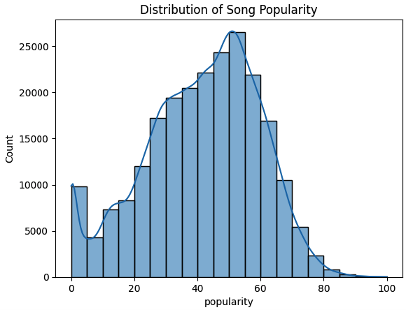

# Spotify Song Popularity Prediction and Clustering
## 🎶 Project Overview 
This project aims to analyze and predict the popularity of Spotify songs using supervised learning techniques for classification, as well as group songs based on their audio features using unsupervised learning techniques for clustering. The dataset includes over 230,000 Spotify tracks, with various audio characteristics, such as acousticness, danceability, energy, loudness, and more.⚡

### 🔍 Key Objectives:
1. **Supervised Learning (Classification)**: Predict whether a song is popular or not popular based on its audio features.
2. **Unsupervised Learning (Clustering):** Group songs into distinct clusters based on their audio characteristics to uncover hidden patterns and trends.

### 🔗 Project Links:
- [Supervised Learning Project on Kaggle](https://www.kaggle.com/code/lalehseyin/aygaz-ml-project-supervised-learning)
- [Unsupervised Learning Project on Kaggle](https://www.kaggle.com/code/lalehseyin/aygaz-ml-project-unsupervised-learning)

## 📂 Dataset
**🔗 Source:** 
- [Spotify Dataset on Kaggle](https://www.kaggle.com/datasets/zaheenhamidani/ultimate-spotify-tracks-db)
  
**🗂 Dataset Description:**
- Columns:
  - `genre:` The genre of the song.
  - `artist_name:` The artist of the song.
  - `track_name:` The name of the track.
  - `track_id:` The unique Spotify track ID.
  - `popularity:` The popularity score of the song (ranging from 0 to 100).
  - `Various audio features including:` acousticness, danceability, duration_ms, energy, instrumentalness, liveness, loudness, mode, speechiness, tempo, time_signature, valence.
    
**📈 Exploratory Data Analysis (EDA)**

During the exploratory data analysis phase, several visualizations were created to better understand the Spotify dataset. The following plots give insights into the data distribution and correlations between the audio features.

1. **Correlation Matrix of Spotify Features**
This heatmap shows the correlation between various features in the dataset, helping to identify any potential relationships between them.


2. **Distribution of Song Duration (ms)**
This histogram illustrates the distribution of the song duration, showing the majority of songs last between 150,000 and 300,000 milliseconds (roughly 2.5 to 5 minutes).


 3. **Energy vs Loudness with Popularity as Hue**
This scatter plot demonstrates the relationship between energy and loudness across songs, with the popularity indicated by color. It highlights that more energetic and louder songs tend to be more popular.


4. **Distribution of Song Popularity**
This histogram shows the distribution of song popularity, indicating that a large proportion of songs have moderate popularity scores, and fewer songs are at the extremes.




**⚙️ Preprocessing:**
- **Handling Missing Data:** Missing values were handled through row deletion and imputation.
- **Data Cleaning:** Songs with extreme loudness or duration values were removed to enhance the model’s performance.

## ✅ Supervised Learning
**📝 Task: Classification**

The goal was to classify songs as either popular or not popular based on their audio features, where:
- Popular: `popularity ≥ 50`
- Not Popular: `popularity < 50`

**🧩 Model Selection:**

Three models were evaluated for regression tasks using cross-validation. Though the task is classification, we evaluated models using regression metrics due to time constraints.

**🛠️ Cross-Validation Results:**
- **Linear Regression:** Mean CV MSE: 293.8958
- **Random Forest: Mean CV MSE:** 269.4181 (Chosen as the best model)
- **Support Vector Regressor:** Mean CV MSE: 277.9318

**🏅 Final Model: Random Forest Classifier**
- **Chosen Model:** Random Forest was selected as the best-performing model based on cross-validation results for regression. This model was then applied to the classification task to predict whether songs are popular or not.

**📊 Classification Metrics:**
- Accuracy: 73.16% - The model correctly predicted the popularity status of songs 73% of the time.
- Precision: 66.38% - 66% of the songs predicted as popular were actually popular.
- Recall: 54.70% - The model identified 54% of all popular songs.
- F1 Score: 59.98% - A balanced score between precision and recall, indicating moderate performance in predicting popular songs.

**🟩 Confusion Matrix:**
```
[[24179  4642]
 [ 7589  9165]]
```
## ✅ Unsupervised Learning
**Task: Clustering**

The goal of unsupervised learning was to group songs based on their audio characteristics without knowing their popularity scores.

**🧩 Model Selection:**

Several clustering algorithms were evaluated based on the Silhouette Score to determine the best model for grouping songs.

**🎯 Clustering Evaluation:**
- **k-Means:** Silhouette Score: 0.1938 (Chosen as the best model)
- **DBSCAN:** Silhouette Score: -0.6465
- **GMM:** Silhouette Score: 0.0158

**🏅 Final Model: k-Means Clustering**
- **k:** 3 (optimal number of clusters)
- **Silhouette Score:** 0.1938

**📊 Cluster Analysis:**
The songs were grouped into three distinct clusters based on their audio features. Below is the ***average popularity per cluster***:
| Cluster ID | Average Popularity |
|------------|--------------------|
| 0          |21.49               |
| 1          |31.04               |
| 2          |45.50               |

**🖼️ Visualizations:**
1. PCA 2D Projection of Clusters:

- This visualization shows how the songs were grouped in 2D space using PCA. The distinct clusters suggest meaningful separations between different types of songs based on their features.
  


2. Average Popularity per Cluster:

- The bar chart shows the average popularity for each cluster. Cluster 2 contains the most popular songs, while Cluster 0 has the least popular songs.


